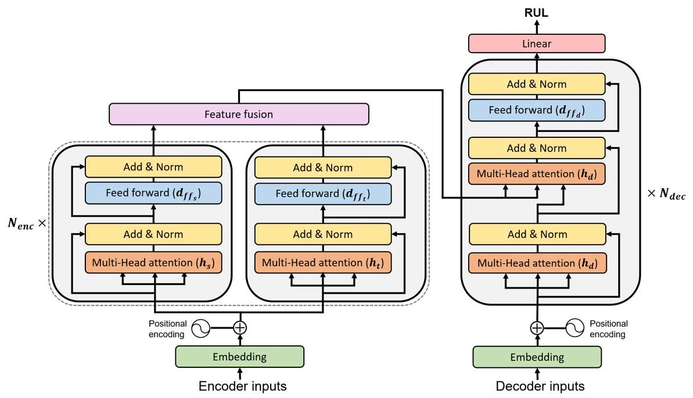

# NAS_transformer
Evolutionary Neural Architecture Search on Transformers for RUL Prediction


This work introduces a custom genetic algorithm (GA) based neural architecture search (NAS) technique that automatically finds the optimal architectures of Transformers for RUL predictions. Our GA provides a fast and efficient search, finding high-quality solutions based on performance predictor that is updated at every generation, thus reducing the needed network training. Note that the backbone architecture is [the Transformer for RUL predictions](https://arxiv.org/abs/2106.15842) and the preformance predictor is [the NGBoost model](https://arxiv.org/abs/1910.03225)  <br/>

The proposed algorithm explores the below combinatorial parameter space defining the architecture of the Transformer model.
<p align="center">
  
</p>

<p align="center">
  
</p>

## Prerequisites
Our work has the following dependencies:
```bash
pip install -r requirements.txt
```

## Descriptions
- data_process_update_valid.py: to process multivariate time series data for preparing inputs for the Transformer.
- initialization_LHS.py: to perform the full training of the networks selected by LHS and to collect their validation RMSE to be used for training NGBoost.
- enas_transformer_cma_retraining.py: to run the evolutionary search and to find the solutions.
- topk_test.py: to calculate the test RMSE of each solution.


## Run
Data preparation
```bash
python3 data_process_update_valid.py --subdata 001 -w 40 -s 1 --vs 20
```
Predictor initialization
```bash
python3 initialization_LHS.py --subdata 001 -w 40 -t 0 -ep 100 -n_samples 100 -pt 10
```
Evolutionary NAS
```bash
python3 enas_transformer_cma_retraining.py --subdata 001 -w 40 --pop 1000 --gen 10 -t 0 -ep 100 
```
Test results
```bash
python3 topk_test.py --subdata 001 -w 40 -t 0 -ep_init 100 -ep_train 100 --pop 1000 --gen 10 --model "NGB" -topk 10 -sp 100 -n_samples 100 --sc "ga_retrain"
```


## Results
The performance of the discovered solutions in terms of test RMSE

| Metrics \ sub-datasets | FD001 | FD002 | FD003 | FD004 | SUM   |
|------------------------|-------|-------|-------|-------|-------|
| Test RMSE              | 11.50 | 16.14 | 11.35 | 20.00 | 58.99 |
| s-score                | 202   | 1131  | 227   | 2299  | 3858  |


## Note
```
This work is submitted to Materials and Manufacturing Processes
```
